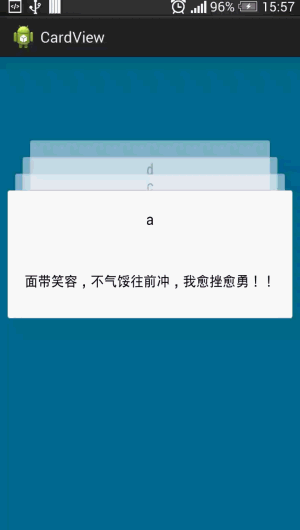

3d卡片效果
=======

- 测试版本4.1.2，4.2.2，4.4.2可用

##使用

	CardView cardView = (CardView) findViewById(R.id.cardView1);
	//设置间距
	cardView.setItemSpace(Utils.convertDpToPixelInt(this, 20));
	//设置可见数量,默认4个
	cardView.setMaxVisibleCount(4);
	//点击顶部card监听
	cardView.setOnCardClickListener(new OnCardClickListener(){
		public void onCardClick(View view, int position) {
		}
	});

##问题

- `CardView`高度设置为`wrap_content`卡片会显示不全。
- `CardView`设置`padding`和`margin`，旋转动画会有被截断的效果。最后一张卡片距离顶部的距离是在CardView内部指定的，为固定值。
- 测试2.3.2有严重bug（估计4.0版本之前都有此bug），不可用。

